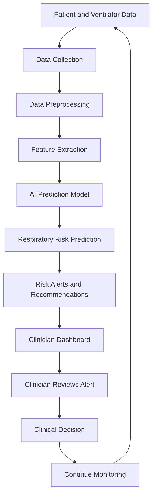

# Genesis 2026: Ideathon
Workflow of our proposed solution

```mermaid
graph TD
    A["Patient and Ventilator Data"] --> B["Data Collection"]
    B --> C["Data Preprocessing"]
    C --> D["Feature Extraction"]
    D --> E["AI Prediction Model"]
    E --> F["Respiratory Risk Prediction"]
    F --> G["Risk Alerts and Recommendations"]
    G --> H["Clinician Dashboard"]
    H --> I["Clinician Reviews Alert"]
    I --> J["Clinical Decision"]
    J --> K["Continue Monitoring"]
    K --> A
```
